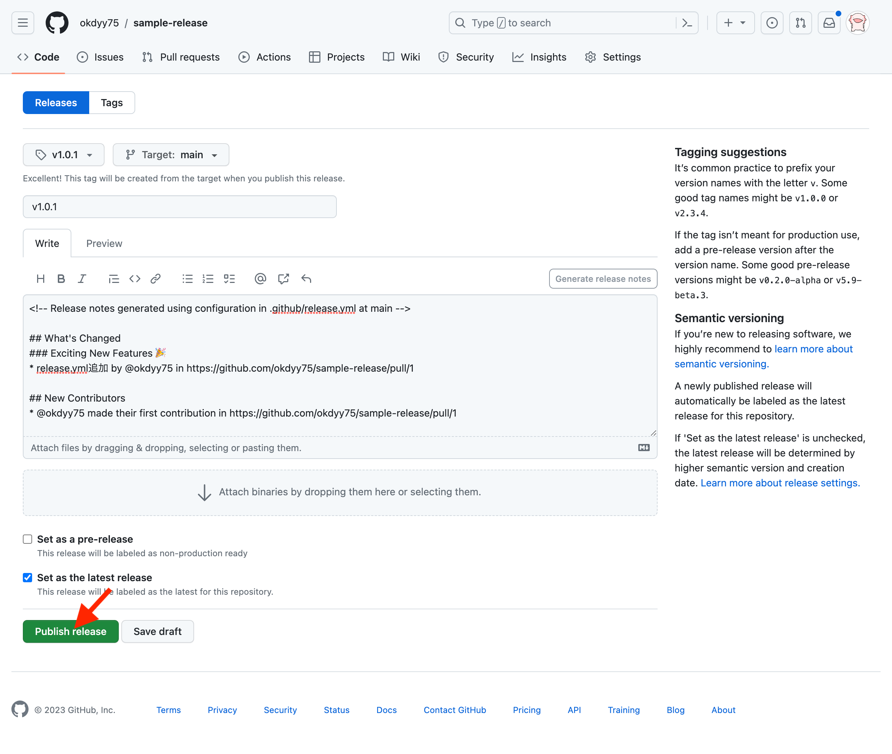

## GitHubのリリース機能の使い方
簡単に説明するとライブラリやソフトウェアのリリースをGitHub上で管理できる機能です。

### Release作成の流れ

#### 1. GitHubのReleasesリンクをクリック


#### 2. 「Draft a new release」をクリック


#### 3. Release対象とするタグを選択して各項目を入力し「Publish release」をクリック


#### 4. 新しいReleaseが追加されます


## Release作成ページ解説
基本的にはタグの指定さえあれば作成可能です。ちなみにこの画面上からタグも作成できます。


### Choose a tag
Release作成時のタグを指定します。ここから新しくタグの作成も可能です。

新しくタグを作成する場合は「Choose a tag」にタグ名を入力し「Create new tag」を選択。作成元となるブランチorコミットを指定します（ReleaseをPublishしたタイミングではじめてタグが作成されます）


### Generate release notes
「Generate release notes」をクリックするとリリースノートの自動生成ができます。この時にリリースノート内に表示するリリース内容の差分は「Previous tag」から指定できます。

リリースノートの自動生成をやり直したい場合は、Descriptionをクリアすると、再度「Generate release notes」がクリック可能になります


### pre-release と latest について
pre-releaseのチェックをつけるとpre-releaseラベルをつける事ができます。その名のとおり、リリース前の目印となります

latestのチェックは最新のReleaseに対してLatestのラベルをつける事ができます。LatestがつけられるReleaseはひとつだけです。


### Publish release と Save draft
基本的にPublishをするとReleaseが作成＆公開されますが、公開する前に下書きを作成することも可能です。

Draft時に「Choose a tag」でタグ名を指定しておくと、Publishしたタイミングでタグが作成できるのもポイントです


## release.ymlについて
リリースノートの自動生成ですが `.github/release.yml` を作成しておくと、リリースノート内容に表示するPR一覧を、ラベル別にカテゴリを分けて表示する事ができます。

.github/release.yml
```yml
changelog:
  exclude:
    labels:
      - ignore-for-release
    authors:
      - octocat
  categories:
    - title: Breaking Changes 🛠
      labels:
        - Semver-Major
        - breaking-change
    - title: Exciting New Features 🎉
      labels:
        - Semver-Minor
        - enhancement
    - title: Other Changes
      labels:
        - "*"

```


実際の表示がこちら


詳しくは公式ドキュメントをチェック！

自動生成リリース ノート - GitHub Docs  
https://docs.github.com/ja/repositories/releasing-projects-on-github/automatically-generated-release-notes


### 最後に

基本的にはGitHubの公式ドキュメントを一読することをオススメします！  

リポジトリのリリースを管理する - GitHub Docs  
https://docs.github.com/ja/repositories/releasing-projects-on-github/managing-releases-in-a-repository


#### 参考リンク
GitHubのリリース機能の使い方  
https://github.com/okdyy75/sample-release

GitHubのリリース機能を使う  
https://qiita.com/todogzm/items/db9f5f2cedf976379f84
